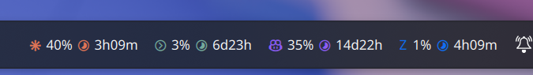
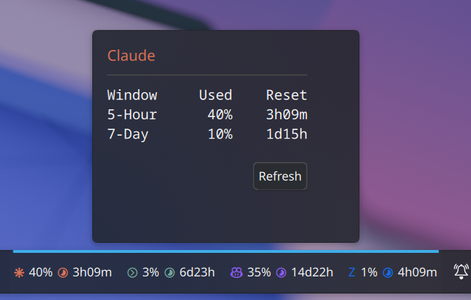
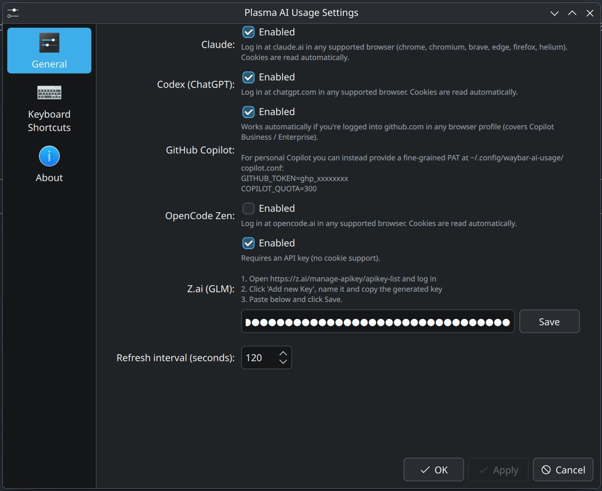

# Plasma AI Usage Panel

KDE Plasma 6 widget that shows **Claude**, **Codex (ChatGPT)**, **GitHub Copilot**, **OpenCode Zen** and **Z.ai (GLM)** usage **directly on the panel**.

Unlike other Plasma AI widgets that only render inside the popup, this one keeps a compact chip per provider on the system tray — same idea as the [waybar-ai-usage](https://github.com/NihilDigit/waybar-ai-usage) module on Hyprland, ported to KDE.



Click any chip to expand the detail popup:



Per-provider setup lives inside the widget config:



## Features

- One compact chip per provider on the panel (icon + % + reset time)
- Click any chip to open a popup with the detailed Window / Used / Reset table
- Auto-discovers cookies across **all Chrome / Chromium / Brave profiles** — handles the common case where personal and Enterprise accounts live in different profiles
- In-widget config: enable/disable providers, paste Z.ai API key, set refresh interval
- Colored icons per provider (Claude orange, Codex green, Copilot purple, Z.ai blue, Zen orange)

## Authentication

| Provider | Auth |
|---|---|
| Claude | Browser cookie (claude.ai) |
| Codex (ChatGPT) | Browser cookie (chatgpt.com) |
| Copilot | Browser cookie (github.com) — also accepts a PAT in `~/.config/plasma-ai-usage-panel/copilot.conf` for personal plans |
| OpenCode Zen | Browser cookie (opencode.ai) |
| Z.ai (GLM) | API key from [z.ai/manage-apikey/apikey-list](https://z.ai/manage-apikey/apikey-list) — paste it in the widget config |

Supported browsers: Chrome, Chromium, Brave, Edge, Firefox, Helium.

## Install

```bash
# 1. CLI helpers (Python data collectors)
mise use -g uv@latest        # if you don't have uv
uv tool install --from . plasma-ai-usage-panel

# 2. Plasmoid
./install.sh
```

Then right-click the panel → *Add or Manage Widgets* → search **"Plasma AI Usage"**.

## Uninstall

```bash
kpackagetool6 --type Plasma/Applet --remove com.github.gustavobragac.plasmaaiusage
uv tool uninstall plasma-ai-usage-panel
```

## Credits

Python data-collection scripts come from [NihilDigit/waybar-ai-usage](https://github.com/NihilDigit/waybar-ai-usage). The plasmoid (QML) is original and built specifically for KDE Plasma 6.

## License

MIT
